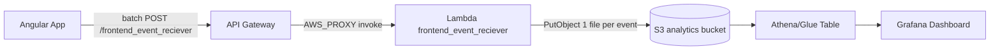
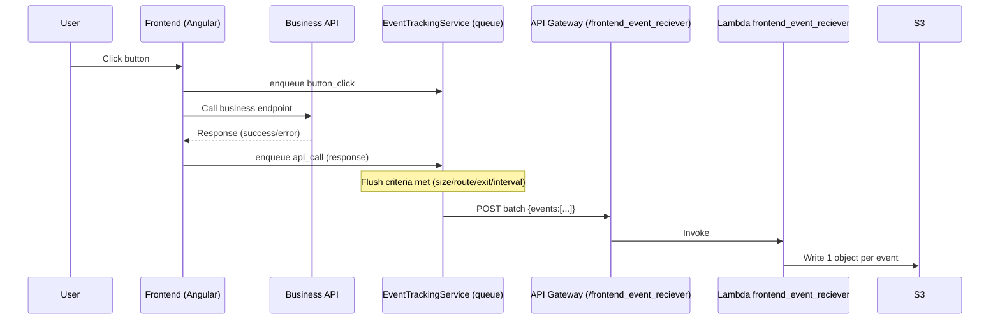

# Analytics Events (Event Recorder)

This document describes the analytics event capture feature from the frontend perspective, plus the backend/infra expectations it depends on.

Canonical end-to-end README (frontend + backend + infra, including diagrams + Grafana details):
- `../../veet-code-go/README.event_recorder_analytics.md`

## Diagrams





## Frontend

### Configuration

File:
- `src/environments/environment.ts`

Required:
- `analyticsEventsApiUrl`: API Gateway URL ending with `/frontend_event_reciever`

If `analyticsEventsApiUrl` is empty, analytics sending is disabled.

### Main API (Single Entry Point)

Application code should call only:
- `AnalyticsCaptureService.capture(...)` (`src/app/analytics/analytics-capture.service.ts`)

`EventTrackingService` (`src/app/analytics/event-tracking.service.ts`) is the internal implementation that:
- builds the event payload
- adds user context from the session
- buffers events into an in-memory queue
- flushes batches to the backend

### Event Types (Semantics)

- `page_access`
  - meaning: the user entered/opened a view
  - phase: `start`
  - typical source: `page_load`

- `button_click`
  - meaning: user UI intent only
  - phase: `start`
  - typical source: `user_click`
  - must not contain `api`

- `api_call`
  - meaning: an HTTP request finished (success/error)
  - phase: `response`
  - source: `page_load` (automatic/interceptor) or `user_click` (manual tracking)
  - must contain `api`

Rule of thumb:
- if a click triggers an API request, emit 2 events:
  - `button_click`
  - `api_call`

### How To Instrument Pages, Buttons, APIs

#### Page access

Call once when the view loads (common pattern: `ngOnInit`).

```ts
constructor(private readonly analyticsCapture: AnalyticsCaptureService) {}

ngOnInit(): void {
  this.analyticsCapture.capture({ type: 'page_access' });
}
```

#### Button click

Preferred: pass the clicked element so label + metadata are derived consistently.

```ts
onClick(event: MouseEvent): void {
  const el = (event.target as HTMLElement | null)?.closest('button, [role="button"]') as HTMLElement | null;
  this.analyticsCapture.capture({ type: 'button_click', element: el });
}
```

Alternative: pass a label directly.

```ts
this.analyticsCapture.capture({ type: 'button_click', buttonLabel: 'Submit Feedback' });
```

Conventions:
- Use real `<button>` elements (or `role="button"`) so delegated capture can find them.
- Don’t double-capture: either use a delegated listener or capture inside the handler, not both.
- If you delegate clicks at a page level (like `QuestionsPageComponent`), ensure synthetic clicks are ignored (`event.isTrusted`).

#### API calls

There are 2 tracking modes.

1) Automatic (default): `ApiEventsInterceptor` (`src/app/analytics/api-events.interceptor.ts`)
- Tracks most HTTP requests.
- Emits `api_call` events.
- Skips Cognito domain, analytics endpoint itself, assets, and manually-tracked endpoints.

2) Manual (recommended for click-driven endpoints)
- Goal: set `source: user_click` and include a meaningful `label`.
- Add the endpoint path to `ApiEventsInterceptor.manuallyTrackedEndpoints` to avoid double counting.
- Emit the `api_call` after you receive the HTTP response.

Example:

```ts
this.analyticsCapture.capture({
  type: 'api_call',
  apiName: 'create_exercise',
  apiMethod: 'POST',
  apiEndpoint: '/create_exercise',
  statusCode: response.status,
  outcome: 'success',
  source: 'user_click',
  label: 'Add Question'
});
```

### Batching And Flush Criteria

Events are buffered and flushed as batches to reduce load on API Gateway/Lambda.

Current flush triggers (see `src/app/analytics/event-tracking.service.ts`):
- queue reaches max size (currently 4)
- Angular route change
- page/tab exit (`pagehide` / `visibilitychange`)
- periodic check every 10 seconds:
  - if queue has events: flush
  - if queue is empty: log and do not call the API

### Delivery Safeguards (Backoff, Rate Limit, Circuit Breaker)

To prevent runaway traffic and protect API Gateway/Lambda, the sender (`src/app/analytics/event-tracking.service.ts`) applies:

- Exponential backoff on retriable flush failures (`status=0`, `429`, `>=500`):
  - base: 500ms
  - doubles each attempt with jitter
  - cap: 30s
  - while backing off: flush attempts are skipped and the queue is kept
- Hard per-session rate limit for flush attempts:
  - window: 60s
  - max: 12 flush attempts per window
  - when exceeded: flush is skipped and the queue is kept
- Circuit breaker:
  - trips after 3 consecutive retriable failures
  - stays open for 120s
  - while open: flush is skipped and the queue is kept

Notes:
- Non-retriable 4xx (except 429) will drop the batch to avoid infinite retry loops.
- Guard logs are throttled to reduce console noise.


## Backend (Go Lambda Expectations)

Backend implementation lives in the Go repo:
- `../../veet-code-go/lc_statistics/cognito_dynamo/frontend_event_reciever`

Responsibilities:
- accept batch payloads: `{ batchId, sentAt, reason, app, events: [...] }`
- validate schema + semantic rules:
  - `button_click` must not contain `api`
  - `api_call` must contain `api`
- write 1 JSON object per event to S3 partitions

S3 key format:
- `analytics-events/anomesdia=YYYYMMDD/app=<app>/eventType=<eventType>/<eventId>.json`

Core lambda env vars:
- `events_bucket_name` (required)
- `EVENTS_PREFIX` (optional, default `analytics-events`)
- `ALLOWED_ORIGINS` (CORS)

## Infra (Terraform Expectations)

Infra lives in:
- `../../veet-code-infra`

Must exist:
- API Gateway resource: `POST /frontend_event_reciever` integrated to the correct lambda (AWS_PROXY)
- `OPTIONS /frontend_event_reciever` configured for CORS preflight
- S3 bucket for events + IAM allowing lambda `PutObject`

Common failure mode:
- API Gateway route points to the wrong lambda or stale deployment (symptom: analytics endpoint returns a business payload).

## Grafana (Athena)

Full local setup notes:
- `athena_grafana_setup.txt`

### Step 1: Create Athena database/table

Run in Athena (adjust bucket name):

```sql
CREATE DATABASE IF NOT EXISTS frontend_events;

CREATE EXTERNAL TABLE IF NOT EXISTS frontend_events.analytics_events (
  eventid string,
  eventtimestamp string,
  ingestiontimestamp string,
  phase string,
  source string,
  feature string,
  page string,
  label string,
  usersub string,
  useremail string,
  apiname string,
  apiendpoint string,
  apimethod string,
  apistatuscode int,
  apioutcome string
)
PARTITIONED BY (
  anomesdia string,
  app string,
  eventtype string
)
ROW FORMAT SERDE 'org.openx.data.jsonserde.JsonSerDe'
LOCATION 's3://veet-code-frontend-events-<ACCOUNT_ID>/analytics-events/';
```

Load partitions:

```sql
MSCK REPAIR TABLE frontend_events.analytics_events;
```

### Step 2: Local Grafana OSS (Docker)

Minimal `docker-compose.yml`:

```yaml
services:
  grafana:
    image: grafana/grafana-oss:latest
    ports:
      - "3000:3000"
    environment:
      - GF_INSTALL_PLUGINS=grafana-athena-datasource
      - AWS_REGION=sa-east-1
      - AWS_ACCESS_KEY_ID=${AWS_ACCESS_KEY_ID}
      - AWS_SECRET_ACCESS_KEY=${AWS_SECRET_ACCESS_KEY}
    volumes:
      - ./grafana/provisioning:/etc/grafana/provisioning
```

Datasource provisioning (`grafana/provisioning/datasources/athena.yaml`):

```yaml
apiVersion: 1
datasources:
  - name: Athena
    type: grafana-athena-datasource
    access: proxy
    jsonData:
      defaultRegion: sa-east-1
      catalog: AwsDataCatalog
      database: frontend_events
      workgroup: primary
      outputLocation: s3://aws-athena-query-results-<ACCOUNT_ID>-sa-east-1/
    secureJsonData: {}
```

### Step 3: Starter panels (SQL)

Events per day:

```sql
SELECT anomesdia, count(*) AS events
FROM analytics_events
GROUP BY 1
ORDER BY 1;
```

Event type split:

```sql
SELECT eventtype, count(*) AS total
FROM analytics_events
GROUP BY 1
ORDER BY 2 DESC;
```

API success vs error:

```sql
SELECT apiname, apioutcome, count(*) total
FROM analytics_events
WHERE eventtype = 'api_call'
GROUP BY 1, 2
ORDER BY 3 DESC;
```

Top pages:

```sql
SELECT page, count(*) total
FROM analytics_events
WHERE eventtype = 'page_access'
GROUP BY 1
ORDER BY 2 DESC
LIMIT 20;
```

## Troubleshooting

- If `/frontend_event_reciever` returns a business payload (ex: `metric_id`), API Gateway is almost certainly integrated to the wrong lambda or a stale deployment.
- If you get CORS errors, confirm `ALLOWED_ORIGINS` includes your frontend origin (or `*`).
- If you see 400 errors about `api`:
  - `button_click` must not include `api`
  - `api_call` must include `api`
